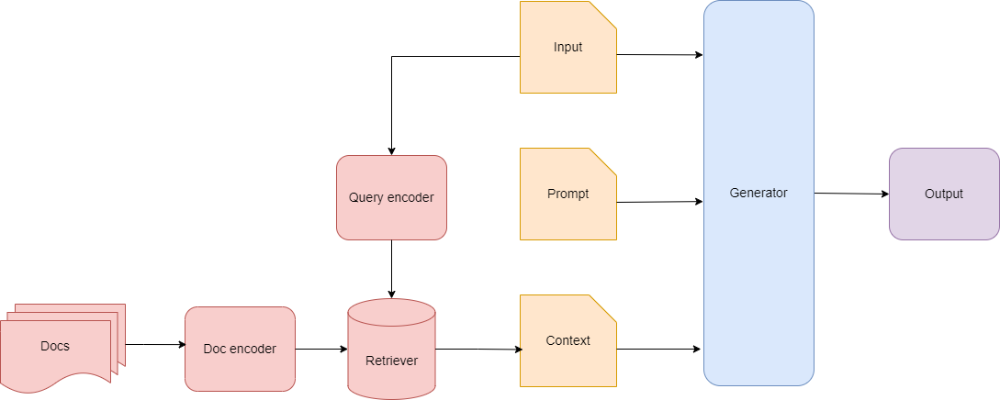

# Attributed Q&A for the Dutch Law using RAG

Project repository for anonymous submission for the NLLP workshop 2024. The main goal is to create a modular RAG system usable to answer Dutch legal questions. The answers contain sources to the Dutch law. To support our work, we introduce a dataset containing a knowledge corpus and over 100 tuples with questions, answers, and attributions to the Dutch law. 

## Task Definition

The task in our work is Attributed Question Answering (AQA), which [Bohnet et al.](https://arxiv.org/pdf/2212.08037.pdf)
introduced in 2023.
In AQA, the input to the model is a question, and the output from the model is an answer string together with a pointer
to a reference.
In this case, the question will be a legal question that will look for an answer containing pre-conditions,
and the pointer will be a reference to the specific law, the chapter, and article.

### Format:

```
Input: Question 
Output: (Answer, Attribution)
```

### Example:

``
Question: "What are the pre-conditions for a refugee to be admitted to the Netherlands?"
``

```
Answer by LLM: 

"The pre-conditions for a refugee to be admitted to the Netherlands are:
1. The refugee has a valid traveling document
2. The refugee is not a threat for public safety

Attributions: Immigration Law, Ch. 3, Article 14; Immigration Law, Ch. 3, Article 16"
```

## Architecture

The system uses a Retriever-Augmented Generator pipeline (RAG).
The retriever component in the system retrieves _k_ relevant passages based on the input question. here, _k_ is a relative small number. Then, a LLM model uses the fetched passages to generate an answer with attributions to the Dutch law. and chooses one or more of the retrieved passages as support for that answer.



Figure of RAG system used by this work.


# Data

The dataset consists of a knowledge corpus and a AQA set. For our work, we release a small and large dataset. These are available in the following files:

**Small:**
- datasets/knowledge_corpus/small_corpus/knowledge_corpus_small.csv
- datasets/QA_set/QA_set_102_largecorpus.csv

**Large:**
- datasets/knowledge_corpus/large_corpus/knowledge_corpus_large.csv
- datasets/QA_set/QA_set_102_smallcorpus.csv

**The knowledge corpus** contains passages from Dutch laws. Each passage contains a unique identifier, and there has been specified where the passage is exactly from by having the law_id, law_name, chapter_title, section_title, article_title, paragraph_title, and text. In total the knowledge corpus in the small dataset contains articles from 17 Dutch laws. The kwnowledge corpus in the large dataset contains articles from 273 Dutch laws. 


**The question and answer set** contains questions, each with a question_id, question_text, human_gold_answer and human_references. The dataset is annotated by human, and verified by a legal expert on legal correctness and completeness. In total, there are 102 question-answer pairs from 17 different laws. 

# Installation

Python 3.8.5 is required for this program.

To use the program, install the requirements by running the following commands in the terminal for the project directory:

1. Install virtual environment
``` 
python -m venv env
```

2. Activate the virtual environment 

Windows:
``` 
.\env\Scripts\activate
```

Linux:
``` 
source env/bin/activate
```


3. Install the required packages for the project
``` 
pip install -r requirements.txt
```

# Getting started

Multiple components can be selected as retriever and generator in the RAG system. To use BM25, follow the instructions direct below. If you want to use a dense encoder from Huggingface, [use the instructions here](#reproducing-results-using-dense-retrievers-and-gpt-or-local-llm).

## Openai API
1. Open the file called `API_key.py` and fill the two variables with your own API keys:
2. `SECRET_KEY = '<YOUR_API_KEY>'`
3. `ORGANIZATION_KEY = '<YOUR_ORGANISATION_API_KEY>'`


## Reproducing Results (using Pyserini BM25 indexer)

### Data and pre-processing (BM25)
1. Run the file `scripts/data_processing/pyserini/pyserini_convert_csv_kc_to_json_docs.py` for pyserini, to convert the knowledge corpus into JSON docs.
2. Run the file `scripts/data_processing/pyserini/pyserini_create_index.py` to create an index.


### Running the experiment pipeline (BM25)
3. In order to generate answers based on retrieved documents: Run the file `scripts/experiment_pipeline_and_evaluation/experiment_pipeline_retrieve_and_generate_BM25_GPT.py` with the QA set and knowledge corpus. This script will utilize a retriever (Pyserini BM25) to find relevant documents and passes these to an LLM paired with the question. 
4. In order to evaluate the newly generated answers: Run the file `scripts/experiment_pipeline_and_evaluation/experiment_pipeline_evaluate.py` with the newly created results file. The MAUVE, ROUGE, METEOR, G-EVAL, and Precision and Recall scores will be calculated and written into a file in the experiments' directory.

If you only want to experiment with retrievers, adjust the configurations and run the `scripts/experiment_pipeline_and_evaluation/experiment_pipeline_only_retrieve.py` script.

## Reproducing Results (using dense retrievers and GPT or Local LLM)
1. Run the wanted embedding model in the folder `scripts/experiment_pipeline_and_evaluation/embedding_models`. After an embedding is created follow step 2.
2. Run `scripts/ experiment_pipeline_retrieve_and_generate_E5_GPT.py` or `scripts/ experiment_pipeline_retrieve_and_generate_E5_GEITJE_LLAMA.py`. You can adjust which models you want to use through the `models` variable in the main function.
3. In order to evaluate the newly generated answers: Run the file `scripts/experiment_pipeline_and_evaluation/experiment_pipeline_evaluate.py`.


## Troubleshooting
Pyserini is built on Anserini, which is built on Lucene and thus on Java 11. In order to make these packages work. Installation of [Java JRE](https://www.java.com/en/) and Java [JDK](https://www.oracle.com/java/technologies/downloads/#jdk22-windows) is required. 
Make sure the environment variables have JAVA_HOME pointing to the JDK path such as `C:\Program Files\Java\jdk-22`.
The Path variable should contain: `%JAVA_HOME%\bin`. 

For TREC-EVAL, we had to install [Microsoft C++ build tools](https://visualstudio.microsoft.com/visual-cpp-build-tools/). 


# Acknowledgment


**Retrievers**:

[Pyserini BM25](https://github.com/castorini/pyserini/)

[multilingual e5](https://huggingface.co/intfloat/multilingual-e5-large)

[SBERT paraphrase](https://huggingface.co/sentence-transformers/paraphrase-multilingual-MiniLM-L12-v2)

[SBERT dutch nli](https://huggingface.co/textgain/allnli-GroNLP-bert-base-dutch-cased)

[BERT dutch legal](https://huggingface.co/Gerwin/legal-bert-dutch-english)

[SPLADE](https://huggingface.co/naver/splade-cocondenser-ensembledistil)

[DRAGON](facebook/dragon-plus-context-encoder)


**Evaluation Framework:**

[TREC-eval](https://pypi.org/project/pytrec-eval-terrier/)

**Large Language Models:**

[OpenAI GPT](https://platform.openai.com/docs/models)

[GEITJE 7B Ultra](https://huggingface.co/BramVanroy/GEITje-7B-ultra)

[FIETJE 2B](https://huggingface.co/BramVanroy/fietje-2b-instruct)

[LLAMA-3B-Dutch](https://huggingface.co/ReBatch/Llama-3-8B-dutch)

